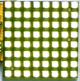
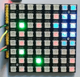
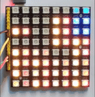
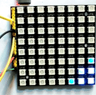
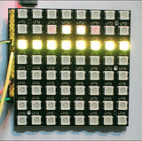
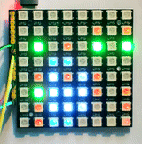
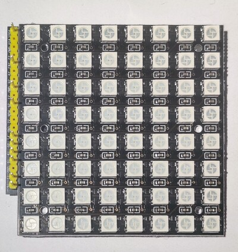
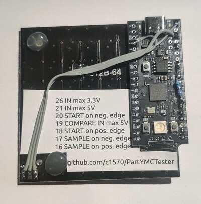

# PartYMCTester
https://github.com/c1570/PartYMCTester

A flashy microcomputer/microcontroller parts tester,
partially inspired by [Axorp's 4040 tester](https://www.forum64.de/index.php?thread/154947-axorps-logic-schaltung-4040-7400-eine-m%C3%B6gliche-reparatur-hilfe/).

## Features
* pulse counter (dual channel, with compare functionality, using RP PWM hardware)
* analog-ish frequency meter
* analog signal histogram
* start trigger (positive or negative edge)
* sampling up to 64 bits with strobe (positive or negative edge, using RP PIO)
* just one button: reset

## Visuals



Above: Waiting for signal on START pins



Above: Counting pulses on IN pin as binary. This is the default mode.
LSB/bit 0 is lower right corner, MSB/bit 31 is upper left corner.
You can deduce signal frequency by finding the LED that flashes about once per second (the blue 'eye' helps with that).
Here, you see 1MHz, 2MHz, 3MHz.
Green LEDs signify some frequencies/digits relevant in context with the [Commodore 64](https://en.wikipedia.org/wiki/Commodore_64): ~60Hz (IRQ), ~1kHz (BA/Badlines), ~1MHz (Phi), ~2MHz (CAS/RAS), ~8MHz (Dotclk).
Switching to analog signal histogram and back every few seconds.


Above: Counting/comparing pulses on IN and COMPARE pins, here: match.
Enabled if signal on COMPARE pin present.



Above: Comparing IN and COMPARE, here: mismatch (note the non-matching binary counts when stopped)



Above: Sampling 64 bits from IN, sampling 120ns after signal edge on SAMPLE pin (here: 10 Hertz on SAMPLE pin, manual toggling on IN pin).
Enabled on signal on SAMPLE pin.
To change the 120ns delay, you have to recompile.



Above: Analog signal histogram (here: 1Hz sine, 1KHz sine, 1KHz square). Disabled in compare mode.



Above: Reset just by pushing on the matrix




[Back full size image](docs/back_full.jpg)

## Project goals
* wire up an 8x8 WS2812 LED board and an RP Pico
* connect the input to any digital signal line and observe the flashing lights
* profit!

**Non-goals**
* any alphanumeric output
* UI or buttons or similar
* make hardware complicated to build or expensive

## Hardware

Best use the cheap RGB LED RP Pico clone board available on AliExpress.
You can also use the original RP Pico but that lacks a reset button.
Wire up as seen in the pictures.
Put a 10k resistor between GPIO 26 and GND; put a 5,6k resistor between GPIO 26 and GPIO 21.
Upload the UF2 file to the Pico and off you go.

## Limitations

Using a simple voltage divider as input has a few drawbacks:
* the RP's ADC input capacitance (about 5pF) is visible somewhat on IN pins
  * ADC readings will be most accurate if the signal (max. 3.3V then) is connected to GPIO 26, but the counter will work up to about 5MHz only then.
  * The counter will work up to at least 10MHz (probably more) if the signal (max. 5V then) is connected to GPIO 21 but ADC readings will be way off if the signal goes above about 3MHz.
* input impedance is 10/15.6k so very high impedance signals will not work.

If you don't need the analog histogram you can leave away the resistors, giving high input impedance and little parasitic input capacity.

You can also add a proper opamp based input amplifier of course.

## Building from source
```
cd src
git clone https://github.com/PDBeal/pico-ws2812
PICO_SDK_PATH=$HOME/project/pico-sdk/ cmake -DPICO_COPY_TO_RAM=1 .
make
```

## License
GNU Affero General Public License v3

Using [PDBeal/pico-ws2812](https://github.com/PDBeal/pico-ws2812) which uses the LGPL v3.0.
