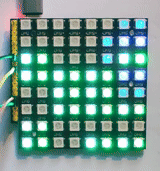

# PartYMCTester
https://github.com/c1570/PartYMCTester

A flashy microcomputer/microcontroller parts tester,
partially inspired by [Axorp's 4040 tester](https://www.forum64.de/index.php?thread/154947-axorps-logic-schaltung-4040-7400-eine-m%C3%B6gliche-reparatur-hilfe/).

## Features
* pulse counter (dual channel, with compare functionality, using RP PWM hardware)
* analog-ish frequency meter
* analog signal histogram
* start trigger (positive or negative edge)
* sampling up to 64 bits with strobe (positive or negative edge, using RP PIO)
* just one button: reset

### Project goals
* wire up an 8x8 WS2812 LED board and an RP Pico
* connect the input to any digital signal line and observe the flashing lights
* profit!

**Non-goals**
* any alphanumeric output
* UI or buttons or similar
* make hardware complicated to build or expensive

## Visuals / Manual

### COUNT mode


Counting pulses on IN pin as binary. This is the **default mode**.
* Here, you see a 1MHz then 2MHz then 3MHz signal.
* LSB/bit 0 is lower right corner, MSB/bit 31 is upper left corner.
* You can deduce signal frequency by finding the LED that flashes about once per second.
  * The blue 'eye' helps with that.
* Green LEDs signify some frequencies/digits relevant in context with the [Commodore 64](https://en.wikipedia.org/wiki/Commodore_64): ~60Hz (IRQ), ~1kHz (BA/Badlines), ~1MHz (Phi), ~2MHz (CAS/RAS), ~8MHz (Dotclk).
* Switching to analog signal histogram (see below) and back every few seconds.

Note that if there's a new signal on IN after some inactivity, the whole display will flash blue briefly.

### Analog signal histogram


Analog signal histogram. This gets displayed in counting mode every few seconds.
* Here, you see:
  * 1Hz sine - wandering line
  * 1KHz sine - long top line, long bottom line, shorter lines in between, meaning the signal is often at max and min voltage, and less time in between.
  * 1KHz square - long top line, long bottom line, nothing between: The signal only uses max and min voltages.
* This mode will help with detecting broken digital outputs and broken pull-ups/pull-downs.
  * A proper digital signal will have characteristics similar to square waves (i.e., no intermediate voltages).

### COMPARE mode



Counting/comparing pulse counts on IN and COMPARE pins, here: match. COMPARE mode gets enabled if a signal on COMPARE pin is present.
* LSB/bit 0 of the IN counter is lower right corner, the LSB of the COMPARE counter is just one LED left to that.
* It is intended for detecting loose connections or unreliable PCB traces.
  * Connect IN to one end of the line and COMPARE to the other end
  * Start everything
  * Slightly bend/knock on/heat/cool components; in case LEDs go red there's a problem.

Mismatching IN/COMPARE counts are displayed by the whole display turning red:


### SAMPLE mode


Sampling 64 bits from IN, sampling 120ns after signal edge on SAMPLE pin. SAMPLING mode gets enabled on signal on SAMPLE pin.
* Here, you see manual toggling on IN pin while a 10 Hertz signal is connected to the SAMPLE pin.
* This mode is intended for checking ROMs and similar components.
  * Connect SAMPLE to the chip select line and IN to a data line
  * You will see the first 64 bits read from/written to that data bit.
* To change the 120ns delay, you have to recompile.

### Reset


Reset just by pushing on the matrix.
You will need to reset to get out of SAMPLE and COMPARE modes.

### START signal


Waiting for signal on START pins.
If nothing is connected to START pins after reset, the device will not wait.
Typically, one will connect the device's RESET line to this.

## Hardware


[Back full size image](docs/back_full.jpg)

Best use the cheap RGB LED RP Pico clone board available on AliExpress.
You can also use the original RP Pico but that lacks a reset button.
Wire up as seen in the pictures.
Put a 10k resistor between GPIO 26 and GND; put a 5,6k resistor between GPIO 26 and GPIO 21.
Upload the UF2 file to the Pico and off you go.

## Limitations

Using a simple voltage divider as input has a few drawbacks:
* the RP's ADC input capacitance (about 5pF) is visible somewhat on IN pins
  * ADC readings will be most accurate if the signal (max. 3.3V then) is connected to GPIO 26, but the counter will work up to about 5MHz only then.
  * The counter will work up to at least 10MHz (probably more) if the signal (max. 5V then) is connected to GPIO 21 but ADC readings will be way off if the signal goes above about 3MHz.
* input impedance is 10/15.6k so very high impedance signals will not work.

If you don't need the analog histogram you can leave away the resistors, giving high input impedance and little parasitic input capacity.

You can also add a proper opamp based input amplifier of course.

## Building from source
```
cd src
git clone https://github.com/PDBeal/pico-ws2812
PICO_SDK_PATH=$HOME/project/pico-sdk/ cmake -DPICO_COPY_TO_RAM=1 .
make
```

## License
GNU Affero General Public License v3

Using [PDBeal/pico-ws2812](https://github.com/PDBeal/pico-ws2812) which uses the LGPL v3.0.
